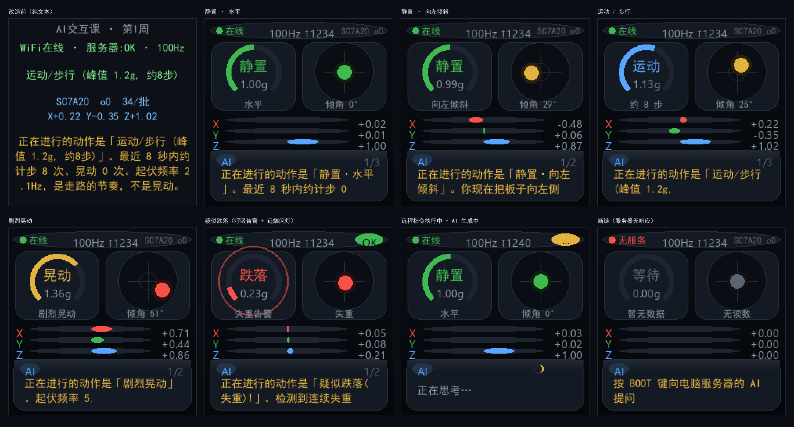

# Ego Link 教学版实现 · AI交互课项目仓库

> 《AI交互原型与用户体验设计》（18 周，贯穿样例"Ego Link 随身智能终端"）的课程项目实现仓库，按周推进。
> 当前进度 **第3周**（已实机跑通）：在第 1 周"采集→上报→存储→展示"、第 2 周"网页远程指令"之上，
> 加上**按键触发 + 本地/远端物理反馈闭环** —— BOOT 键按下板子立刻闪灯（不等网络），
> 服务器判定跌落时自动下发指令让板子快闪告警。
>
> 🏠 项目主页（three.js 数据闭环可视化）：<https://aiflyf.github.io/ego-link-esp32/>

## 课程路线（本仓库逐周生长）

| 周 | 任务 | 状态 |
|---|---|---|
| 1 | 传感数据采集 + 服务器接收/存储 + Web 展示 | ✅ |
| 2 | Web 远程"采集一次"指令（request_id）与执行结果反馈 | ✅ |
| 3 | 按键触发 + 本地/远端物理反馈闭环 | ✅ |
| — | **运行期配置：SoftAP 配网 + NVS**（工程改进，非课程周次） | ✅ |
| — | **多设备：`device_id` 贯穿板端 → 服务端 → 仪表盘**（工程改进，非课程周次） | ✅ 本仓库当前内容 |
| 4–6 | 自然语言查询/请求、按键说话语音链路、澄清与停止 | |
| 7–9 | 按需取图、视觉推理反馈、视觉事件主动询问 | |
| 10–12 | 观测 vs 当前状态（数据年龄）、多源上下文、纠错记忆 | |
| 13–15 | 端侧推理、断网缓存补传、迟到/过期任务处理 | |
| 16–18 | 体验测试、模块迁移、验收复盘 | |

## 整体流程（数据闭环）

```
┌──────────────────┐  WiFi   ┌────────────────────────────────────────────┐
│  ESP32-S3-EYE    │ ──────► │        你的电脑 = 服务器 (server.py)          │
│  ┌────────────┐  │  HTTP   │  ① 接收 IMU 遥测  POST /api/telemetry       │
│  │ IMU 100Hz  │──┼───────► │     每 500ms 一批（默认 50 个样本）           │
│  │ 本地缓冲   │  │  批量   │  ② AI 分析姿态/晃动/计步/跌落（规则引擎，      │
│  ├────────────┤  │  JSON   │     配了大模型 key 时提问改由真 LLM 回答）     │
│  │ LVGL 屏幕  │◄─┼──────── │  ③ 结果回传开发板显示                        │
│  ├────────────┤  │  响应   │  ④ 网页仪表盘实时推送 GET /  (SSE)           │
│  │ BOOT 按键  │  │         │  ⑤ 遥测与事件落盘 server/data/*.jsonl        │
│  └────────────┘  │         └────────────────────────────────────────────┘
│  单击 = 向AI提问  │               浏览器打开 http://<电脑IP>:8000/
│  长按 = 切方向校准│
└──────────────────┘
```

1. **板子**以 100Hz 采样加速度计，在本地缓冲成一批，每 500ms POST 一次到电脑的服务器；
2. **服务器**把整批样本并入滑动窗口，做运动分类（静置/倾斜方向/晃动/步行计步/疑似跌落）；
3. 服务器把 `当前活动 + AI回复` 放进 HTTP 响应里回传，**板子屏幕实时显示**；
4. **单击 BOOT 键** → 下一帧遥测带上 `ask` 标志 → 服务器**立刻**回一句"正在思考…"，
   大模型在后台线程生成答案，下一帧起板子就能读到真正的回复（板端不会被大模型拖住）；
5. **长按 BOOT 键** → 循环切换倾斜方向校准（**0–15**，换档后屏幕会临时显示
   当前档位 `oN` 约 5 秒），存进 NVS，不用重编译；
6. 电脑浏览器打开仪表盘，实时看板子的姿态球、|a| 曲线、事件流和 AI 对话。

> **为什么是"100Hz 采样 + 批量上报"？** 走路频率约 1.5–2.5Hz、自由落体不到 0.5 秒。
> 如果按每 500ms 采一个点（2Hz）直接上报，计步和跌落检测在物理上就不可能做对，
> 只能算出假的数字。现在 HTTP 频率仍是 2Hz，但服务端拿到的是真实波形。

## 目录

| 路径 | 内容 |
|---|---|
| `server/server.py` | 电脑服务器（仅 Python 标准库，无需 pip 安装） |
| `server/data/` | **运行时生成**的 JSONL 日志（git-ignored，见下文"数据落盘"） |
| `device/` | 开发板 ESP-IDF 工程（ESP-IDF v5.4.x，目标 esp32s3） |
| `device/main/` | `main.c` 启动、`accel_input.c` IMU驱动（SC7A20/LIS3DH/MPU6050/QMA7981 自动识别）、`wifi_link.c` WiFi STA、`net_config.c` 运行期配置、`provisioning.c` SoftAP 配网、`transport.c` 采样+HTTP遥测、`led_feedback.c` LED图案播放器、`camera.c` 板载摄像头取帧（esp_video / V4L2，见下文"摄像头"）、`ui.c` LVGL 图形化仪表盘（见下文"板端界面"） |
| `device/main/net_config.c` | **运行期配置的唯一入口**：凭据只从配网写进的 NVS 来（不再回退 Kconfig，见下） |
| `device/main/provisioning.c` | SoftAP + `esp_http_server` 配网页；`provisioning_page.h` 是内联的单页 HTML |
| `device/main/prov_form.c` | 配网表单的解析与校验。**刻意零 IDF 依赖**，可用 host 侧编译器直接测 |
| `device/main/Kconfig.projbuild` | WiFi 账号、服务器 URL、采样周期、上报周期——现在只是**出厂默认值**，优先用配网页改 |
| `tools/gen_font.py` | **必跑**：中文字体子集生成器（生成 git-ignored 的 `device/main/rw1_font.c`） |
| `tools/fake_board.py` | 假开发板：不接硬件就能灌数据、调仪表盘 |
| `tools/ui_preview.py` | 板端 240x240 界面预览渲染器：**解析 `ui.c` 里的 `UI_*` 宏**出图，没有硬件也能验证界面 |
| `tools/verify_server.py` | 服务端回归测试（跑完自报「N/N 通过」，断言数随功能增长；含"大模型不阻塞板端"验证） || `tools/idf_build.py` | 在 Git Bash 里调用 `idf.py` 的包装器（见常见问题） |
| `tools/tools_serial_capture.py` | 非交互串口抓取（复位→打印N秒→退出，需 pyserial） |
| `build_device.bat` / `flash_device.bat` | 干净环境编译 / 烧录+串口抓取（参数化 COM 口与秒数） |
| LICENSE / NOTICE | MIT；第三方组件与字体授权说明 |

以下内容由构建/组件管理器生成、**不入库**：`device/build/`、`device/managed_components/`、
`device/sdkconfig`、`device/main/rw1_font.*`、`server/data/`。

## 首次上手（4 步）

```powershell
# ① 生成中文字体（任意带 fontTools 的 Python；从本机字体裁剪，见 NOTICE 授权说明）
python tools/gen_font.py
python tools/gen_font.py --list-fonts   # 看看本机有哪些可用中文字体

# ② 编译 + 烧录（首次编译会从组件仓库拉取 espressif/esp32_s3_eye 等到 managed_components/）
build_device.bat
flash_device.bat COM3 30        # 端口按设备管理器改；默认 COM10

# ③ 启动服务器（同一直连网络/热点即可）
python server\server.py

# ④ 配网 —— 不用再 menuconfig 了
#    首次上电板子会自己开热点 EGO-LINK-XXXX
#    手机连上（密码看板子屏幕）→ 浏览器打开 http://192.168.4.1
#    选 WiFi、填电脑 IP、点「保存并连接」；板子先试连，成功才保存
```

浏览器打开 <http://localhost:8000/> 即见仪表盘。串口日志出现
`Detected accelerometer: SC7A20` → `Got IP` → `activity: 静置·…` 即闭环成功。

- **WiFi 和服务器地址现在是运行期配置**，配一次就存进 NVS，断电重启直接连。
  要换网络/换电脑 IP：**双击 BOOT** 重新进配网，或长按……都不用，双击就行。
- 服务器地址填电脑 `ipconfig` → WLAN 的 IPv4（**不能** 127.0.0.1）；
  配网页上可以点「测试连接」当场验证通不通。
- **WiFi 账号和服务器地址现在只从配网页来**（存在 NVS 里）。
  `menuconfig` 里**已经没有了** `RW1_WIFI_SSID` / `RW1_WIFI_PASSWORD` / `RW1_SERVER_URL` ——
  2026-09-23 的决定，见下面「运行期配置」一节：那条"回退 Kconfig"的路实际到不了
  （NVS 空就进配网），而且凭据一旦能从 sdkconfig 来，**固件里就会带上 WiFi 密码**。
  唯一保留的 Kconfig 值是上报周期（配网页留空时用它当默认）。
- Windows 防火墙弹窗请**允许**；否则以管理员执行：
  `netsh advfirewall firewall add rule name="rw1-server" dir=in action=allow protocol=TCP localport=8000`
- **离线/国内网络**：首次编译在线拉取组件可先走代理：`set https_proxy=http://127.0.0.1:10808`（按自己代理端口）；完全离线则把已解析的 `managed_components/` 拷入 `device/`（`dependencies.lock` 已提供，保证版本一致）。
- 断网后板子**无限重试**（前8次每2s，之后每15s），网络恢复即自动重连，无需重新烧录。
  **断网期间采样和界面照常**（只是跳过上报）—— 屏幕照样显示姿态、方向词、`oN`，
  所以没网也能看状态、也能标定 IMU 方向。

> 为什么值得做这件事：原来 WiFi 密码是**编译进固件**的，把固件发给同学等于把
> 自己的 WiFi 密码一起发出去。现在密码只在你自己的 NVS 里。

### 采样与上报节奏（menuconfig）

| 配置项 | 默认 | 说明 |
|---|---|---|
| `RW1_SAMPLE_PERIOD_MS` | 10 | 本地 IMU 采样周期，10ms = 100Hz。**不要超过 20ms**，否则计步/跌落做不了 |
| `RW1_TELEMETRY_PERIOD_MS` | 500 | 每 500ms 把缓冲的样本打包成一次 HTTP POST |

### API 协议

| 方法/路径 | 说明 |
|---|---|
| `POST /api/telemetry` | 请求 `{device, batch:[[x,y,z],…], x, y, z, source, ask, q[, result][, btn]}` → 响应 `{ok, activity, reply, pending[, cmd]}` |
| `POST /api/command` | 下发远程指令。单台 `{"name":"capture_once","device":"rw1-07"}` → `{ok, id, device, device_online}`；**多台** `{"name":"led_blink","devices":["a","b"]}` → `{ok, batch, count, results:[…]}` |
| `GET /api/devices` | 所有上报过的设备列表（在线/离线、最后上报距今秒数、当前活动、上报帧数、**方向档位 `orient`**） |
| `GET /api/commands` | 最近 20 条指令及其状态、执行结果。可加 `?device=` 看指定设备 |
| `GET /api/latest` | 快照（状态 + 8s 曲线降采样 + 事件流 + 指令列表），JSON。可加 `?device=` |
| `GET /api/stream` | SSE 实时推送（仪表盘用）。可加 `?device=`；首帧同时带 `devices` 列表 |
| `GET /api/logs` | 落盘目录与文件大小 |
| `GET /` | 网页仪表盘 |

- **`device` 是设备名**（可选字段，老固件不发）。所有带 `?device=` 的接口，
  **不传就回退到"最近上报过的那台"** —— 所以单板场景和以前完全一样，
  老固件、老脚本一行都不用改。传了一个不存在的名字也会回退（并在响应里回带真实
  `device`），不会返回 404 让页面白屏。详见下面「多设备」一节。

- `batch` 是本次周期内的全部样本；`x/y/z` 是最后一帧，供旧版服务端或快速查看。
  只发 `x/y/z`（不带 `batch`）也能用，服务端按单帧处理。
- **`x/y` 是屏幕坐标系（+x 右、+y 下）**：板端在发送前应用了自己的 NVS 方向校准，
  所以服务端说的"上/下/左/右"和板子屏幕上显示的永远一致。
- `pending: true` 表示服务端正在后台调大模型，此时的 `reply` 是占位文案
  （"正在思考…"），下一帧或之后几帧会带回真正的答案。
- `cmd` / `result` 是第 2 周的远程指令字段，见下。

### 网页上的三块新面板（2026-09-23）

| 面板 | 作用 |
|---|---|
| **板子姿态 · 3D** | 一块按实时姿态转动的小板子（橙色小条 = 顶边），配固定的地面网格当参照 —— "板子现在什么姿态"一眼就懂。数据 2Hz 到、画面 60Hz 走，中间做 slerp 平滑，所以是连续转的 |
| **板子设置** | 改 **WiFi 名称/密码、服务器地址、上报周期**，下发到板子并写 NVS。**改 WiFi 会先试连、连上了才保存**（最多 8 秒）—— 密码填错不会把板子弄失联。**上报周期就是"灵敏度"**：越小界面越跟手，但 WiFi 压力越大 |
| **方向档位 oN** | 在「远程指令」卡片里：显示板子当前档位 + 直接点选 `o0`–`o15`（等价于板端长按 BOOT，但不用盲按） |

three.js 用仓库里 vendor 的那份（`docs/vendor/three/build/three.min.js`，服务端
`/vendor/three.min.js` **白名单**放行）—— **不引 CDN**：教室/局域网常常没有外网，
引 CDN 必然白屏。刻意不做通用静态目录，否则 `server/data/` 里的遥测 jsonl 会被一并暴露。

### 跑真浏览器回归（`tools/e2e_dashboard.js`）

`tools/verify_server.py` 只测 HTTP 接口，测不到"页面能不能点"。真浏览器那套补上了这一层：

```bash
# 一次装好 playwright-core（用系统 Chrome，不下载 Chromium）
mkdir -p ~/.workbuddy-ai/binaries/node/workspace && cd ~/.workbuddy-ai/binaries/node/workspace
npm install playwright-core --no-audit --no-fund

# 跑（它自己起独立端口 + 两块假板子，不碰你正在用的 8000）
NODE_PATH="<上面那个>/node_modules" node tools/e2e_dashboard.js
```

它上线当天就抓到 **4 个真 bug**：档位显示不刷新（时序）、每次打开一条 favicon 404、
**服务端把 `set_orient` 的档位参数丢掉**（只验请求体发现不了）、
**设备上线后指令按钮一直是灰的**（`disabled` 只在构建时算过一次）。
教训写在文件头的注释里：**要验"服务端存下的"，不能只验"页面发出的"**。

### 远程指令通道（第 2 周）

**多选/全选批量下发**：设备卡片里每台前面有复选框，勾几台，下面的指令就同时发给这几台
（服务端一次请求给每台各建一条命令，会自动去重、保持顺序）。不勾任何一台 =
只发给「当前查看的那台」—— 单板场景和以前完全一样。
典型用法：一个班 20 块板同时闪灯确认在线（全选 → `led_blink`）。

**方向档位 `oN` 可以远程校准**：「远程指令」卡片里有一个档位选择器 + 「应用档位」按钮，
选中目标板后直接点选 `o0`–`o15` 即可（等价于板端长按 BOOT，但不用盲按 N 次）。
板端每帧上报自己的档位，所以网页能看到「板子现在是哪一档」——
2026-09-23 真机标定时就是靠长按一次次试出来的，有了这个就不用猜了。

板子是**纯客户端**：它只会周期性地 POST，没有监听端口、收不到服务端主动推送。
所以指令用「搭车」的方式走：

```
网页点「采集一次」
   │  POST /api/command {"name":"capture_once"}
   ▼
服务器  ── queued ──►  把指令挂进**下一帧**遥测的响应里
   │                        {"cmd":{"id":"c-…","name":"capture_once"}}
   ▼                                   │  第 N 帧
板子   ── 用正常的 10ms 采样节拍累积 20 个样本（200ms），算平均与标准差
   │                                   │
   │  POST /api/telemetry              ▼
   │  {"…","result":{"id":"c-…","ok":true,"ms":200,"n":20,"x":…,"y":…,"z":…,"std":…}}
   │                                   │  第 N+1 帧
   ▼
服务器  ── done ──►  按 request_id 匹配，写进指令历史 + 事件流 + SSE
```

一次往返 = **2 个遥测周期**（默认 1 秒）。网页上能看到
`queued → sent → done` 的完整过程，`/api/commands` 里能查到每次采集的
平均值、样本数、耗时和标准差。

- 指令名走白名单（`CMD_NAMES`），不认识的名字直接 400。
- 服务器**一次只发一条**，板子也一次只执行一条，语义简单不会乱序。
- 下发后 `CMD_TIMEOUT_S`（默认 10 秒，`--cmd-timeout` 可调）没回音就判 `timeout`，
  网页不会一直转圈。
- 板端也有一层本地保护：2 秒内凑不齐样本就回 `ok:false` + 原因。
- 结果**上传成功后才清除**，失败会在下一帧重发（与 `ask` 的重试策略一致）。
- 采集复用正常的采样节拍，**不额外阻塞**；屏幕上数据行会显示 `采集中 / 采集OK / 采集NG`。

### 物理反馈闭环（第 3 周）

板载硬件：ESP32-S3-EYE 在 **GPIO3 上有一颗 LED**（`BSP_CAPS_LED=1`）；
**没有喇叭**（`BSP_CAPS_AUDIO_SPEAKER=0`，只有麦克风），所以"物理反馈"就用这颗灯。

三个方向都做了，闭环是完整的：

```
① 本地反馈 —— 不等网络
   BOOT 单击 ──► LED 立刻闪 1 下（60ms）
              └► 同时把 ask=true 带进下一帧遥测

② 远端反馈 —— 服务器 → 板子
   服务器判定跌落 ──► 自动下发 led_blink{n:3,on_ms:80,off_ms:80}
                    └► 板子快闪 3 次做物理告警（不用人点）
   网页点「闪灯 ×3」/「LED 常亮」 ──► 同样走指令通道

③ 回复到达
   服务器/AI 的回复文本变了 ──► LED 闪 2 下（"远端真的回话了"的物理信号）
```

LED 图案由一个小播放器驱动（`device/main/led_feedback.c`）：每个图案是一串
「亮/灭 + 持续多久」的段，用 `esp_timer` 逐段推进，**不阻塞任何任务**。
BSP 自带的 4 个效果（on/off/快闪/慢闪）都是**无限循环**，做不了"闪 3 次然后停"，
所以没有直接用。

| 图案 | 含义 |
|---|---|
| 1 短闪（60ms） | 按键被识别 |
| 2 短闪 | 服务器/AI 回复到达 |
| 2 中闪（120ms） | 收到并开始执行远程指令 |
| 3 快闪（80ms） | 远端告警（跌落） |
| 长亮 1 秒 | 链路或指令失败 |

按键次数也会随遥测上报（`btn` 字段），网页和日志里能看到"物理动作真的发生了"，
而不只是间接看到 `ask`。

新增的两条指令：

| 指令 | 参数 | 说明 |
|---|---|---|
| `led_blink` | `{n, on_ms, off_ms}` | 闪 n 次；n ≤ 12，时长 20–5000 ms |
| `led_set` | `{on}` | 常亮 / 熄灭 |

参数**两侧都夹**：服务端 `sanitize_params()` 先夹一道，板端 `led_feedback_blink()` 再夹一道——
外部输入不信任，谁也别指望对方把好关。


### 运行期配置：SoftAP 配网

**要解决的问题**：WiFi SSID / 密码 / 服务器地址原来只能靠 menuconfig 改，改一次要
全量重编译 + 烧录；PC 换个 DHCP 地址就得再来一遍。**更要命的是编译出来的固件里
WiFi 密码是明文**——把固件发给同学/老师，等于把自己的 WiFi 密码一起发出去。

现在改成运行期配置：

```
首次上电 / NVS 里没有凭据 / 双击 BOOT
            │
            ▼
  板子开热点 EGO-LINK-<MAC后2字节>，密码是屏幕上的 8 位随机数
            │   手机连上 → 浏览器打开 192.168.4.1
            ▼
  填表：① 扫描选 WiFi  ② 服务器地址（可当场「测试连接」）  ③ 设备名  ④ 上报周期
            │
            ▼
  点「保存并连接」→ 板子**先试连**（最长 15 秒）
            │
       ┌────┴────┐
     失败        成功
       │          │
  页面红字报原因   写 NVS → 转 STA → 屏幕显示新 IP
  **不写 NVS、     AP 自动关闭
   不关 AP，可重试**
```

**为什么是"先试连再保存"**：用户永远知道失败在哪一步；也不会把一份连不上的凭据
存进去，导致下次开机直接失联。这正是"配完了没数据、不知道是 WiFi 还是服务器地址错"
那个排查地狱的解药——所以服务器地址旁边还有个「测试连接」按钮当场验。

**配置只有一个来源：配网**（2026-09-23 决定）。
原来这里写着"`net_config_load()` 在 NVS 为空时逐项回退 `CONFIG_RW1_*`，
所以老 `sdkconfig` 一字不改仍然能跑"——**那句话在实机上不成立**：
`net_config_present()` 只看 NVS，NVS 空就进配网，**根本走不到那条回退路径**
（PROPOSAL §1.8 验收 #9 因此也没实现）。

现在的取舍是"配网是唯一入口"，好处很硬：**固件里永远不可能包含 WiFi 密码**。
代价是每块新板子都要用手机配一次网（双击 BOOT 进热点 → 填表），
换来的是"改网络/改服务器地址永远不用重编译"。

**三条重新配网的入口**（缺一条就可能"配错了只能重烧"）：

1. NVS 里没有凭据 → 开机自动进 AP（首次上电的自然路径）
2. **双击 BOOT** → 强制重新配网（刻意不动现有的单击提问 / 长按校准两个手势）
3. 配网页上的「清除配置并重启」

AP 存活 **5 分钟无操作自动关闭**回 STA（避免忘记关热点长期占道 + 耗电），
屏幕上提示"配网超时"。

| 路由 | 说明 |
|---|---|
| `GET /` | 配网页。**内联在固件里、零外部请求**——配网时手机连的是板子自己的热点，根本没有外网，引 CDN 必然白屏 |
| `GET /scan` | 扫描周边 AP，返回 `{nets:[{ssid,rssi,open}]}` |
| `GET /testurl?url=` | 当场测试服务器地址通不通 |
| `POST /save` | 解析表单 → 校验 → **先试连** → 成功才写 NVS |
| `POST /clear` | 清 NVS 并重启 |

开机自检会打印一行 `net: ssid=... url=... source=NVS|Kconfig`，一眼看清配置从哪来。

**两处刻意偏离原设计的地方**：

1. 原方案建议"配网期间用纯 `WIFI_MODE_AP`，不做 APSTA"，但验收要求"密码错误时页面
   红字报错、**不关 AP**"。如果试连时切成纯 STA，手机连接会立刻断，用户永远看不到
   那个错误提示。所以**试连**那一小段切 **APSTA**（手机保持连着才能收到结果）。
2. **扫描也必须 APSTA**（2026-09-22 真机踩到）：`esp_wifi_scan_start()` 要求 STA
   接口已启用，**纯 AP 模式下会失败** → 页面的 WiFi 下拉框永远是空的，周围明明有
   WiFi 也扫不到、刷新也没用。所以 `/scan` 先切 APSTA（但**不** `esp_wifi_connect()`，
   STA 只是"存在且空闲"，热点不会被频道带走），扫完也不切回纯 AP —— 来回切模式反而
   更容易把手机连接抖掉。扫描失败时接口会回 `err` 字段，页面把它显示出来，
   免得用户分不清"设备端出错"和"周围真没有 WiFi"。

### 多设备（一个班 20 块板）

单板时代服务端只有一个全局 `STATE`，两台板一起上报会**互相覆盖**——姿态球在两台之间跳。
课堂场景下这是硬伤：配网做得再好，20 块板也只是"一起挤进同一个单设备仪表盘"。

现在按设备分片：

```
板端每一帧都带 device  ──►  服务端 DEVICES[device_id] 各自一份状态
                              （各自的 8s 窗口 / 事件流 / 指令队列 / AI 回复）
                                        │
                                        ▼
                     仪表盘顶部「设备」卡片：每台一行，点一下切过去看详情
```

- **设备名从哪来**：配网页的「设备名」填了就用它（`第三组-07` 这种比 MAC 好认）；
  **留空则按网卡 MAC 自动生成 `rw1-XXXX`**，且刻意和热点名 `EGO-LINK-XXXX` 用
  同样两个字节 —— 学生看到热点名就知道该在列表里点哪个。
- **不填也不会撞车**：以前这里兜底填死 `"rw1"`，20 块没改过名的板子在服务端就是
  同一台设备。现在"留空"是一个有意义的值（自动命名），不再是坑。
- **向后兼容**：老固件不带 `device` 字段 → 全部归到默认设备 `-`，
  所有不带 `?device=` 的接口也照旧回退到"最近上报过的那台"。**单板场景行为不变。**
- **指令定向下发**：网页上选中哪台，指令就只进哪台的队列；跌落告警也只发给摔的那台
  （20 块板同时闪灯是噪音）。
- **也可以批量下发**：设备卡片里勾多台（或点「全选」），指令就同时发给这几台 ——
  一次请求服务端给每台各建一条命令，去重、保持顺序。
- **上限**：同时在册 32 台，超出时淘汰最久没上报的那台。
- **落盘**：`telemetry-*.jsonl` / `events-*.jsonl` 每行都带 `dev` 字段，事后能按板分析。

设备名是**外部输入**（用户在配网页手填），所以两端各夹一道：板端用
`json_escape_append()` 转义（一个裸引号就能把整帧 JSON 打坏），服务端剥掉不可打印
字符并限长 32 字符（`\n` 会破坏 SSE 的"一行一个 data:"分帧）。

### 板端界面（240x240 图形化仪表盘）

早期版本的 `ui.c` 是四个居中的纯文本 label：把服务器返回的整句活动文案
（如 `运动/步行 (峰值 1.2g, 约8步)`）直接塞进 240px 宽的 label，被 `LV_LABEL_LONG_DOT`
截成 `…`，现场看不出重点。现在改成图形化仪表：

```
+--------------------------------------------+
| * 在线        100Hz                 ↑1234  | 状态胶囊：链路 / 采样率 / 上报数
+----------------------+---------------------+
|        /-----\\       |     /-------\\       |
|        | 静置 |       |     |   *   |       | 左：活动环（量程=|a| 0..2g）
|        \\-----/       |     \\-------/       | 右：姿态球（重力方向）
|         水平         |     倾角 12° o4      |
+----------------------+---------------------+
| X ===------   Y ==-----   Z =====-----     | 三轴对称条（±2g，0 在中点）
+--------------------------------------------+
| [AI]                             (o)  1/2  |
|  服务器回复（超长自动分页，每 4 秒翻一页）    |
+--------------------------------------------+
```

> **长按 BOOT 换档后，倾角小字会临时变成「倾角 N° oN」，5 秒后自动收回**。
> `oN` 是传感器→屏幕的轴映射档位（0–15）；平时不显示，免得把这一行挤满。
> 传感器芯片名（SC7A20 等）只在串口日志里，界面上不显示。
>
> 姿态球与倾角数字都经过**低通滤波**：`acos(|z|/|a|)` 在接近平放时
> 对噪声极敏感（0.03g 就能算出 14°），滤波前会出现「球稳稳居中、
> 倾角数字乱跳到十几度」这种自相矛盾的画面。

- **活动环**：活动不再是一句话，而是「活动词 + 语义色 + 环」。颜色跟着活动走：
  静置绿 / 步行紫 / 运动蓝 / 晃动琥珀 / 跌落红。服务器原句里的细节
  （水平 / 向左倾斜 / 峰值 / 约 N 步）**被解析出真实数值**后另起一行小字，不再被截断。
- **姿态球**：直接用 `transport_status_t.x_g/y_g`（屏幕坐标系）放点，与网页仪表盘、
  与上报给服务端的数据是**同一套方向语义**，不做二次翻转。
- **三轴对称条**：±2g 对称条，0 在中点，正负一眼分得开。
- **AI 回复自动分页**：按显示宽度切页（中文记 2 列，优先在空格/句读处断），每 4 秒翻一页，
  右下角显示 `1/2`。长回复不再被 `…` 吃掉，而是**逐页读全**。
- **状态即颜色**：跌落时活动环外多一圈呼吸红光；断链时状态点呼吸，在线时保持常亮
  （不做无意义重绘，避免 240x240 SPI 屏撕裂）；远程指令状态在胶囊右侧显示 `···/OK/NG`。
- **几何零硬编码**：尺寸与配色全部集中在 `ui.c` 顶部的 `UI_*` 宏里，
  `tools/ui_preview.py` **解析同一份宏**渲染预览图 —— 改布局时预览自动跟着变，
  不会出现"代码改了、预览图还是旧的"。

没有硬件也能看界面（Pillow 渲染，与固件同源）：

```powershell
python tools\ui_preview.py            # 输出 docs/ui-preview/screen-*.png + contact-sheet.png
python tools\ui_preview.py --scale 3  # 拼接图放大 3 倍
```



### 摄像头（板载 OV2640）

板子自带一颗 OV2640，但**驱动栈不是老的 `esp_camera`**，而是 `esp_video` ——
一套 Linux V4L2 风格的接口。网上大部分 ESP32 摄像头教程用的是 `esp_camera`
（`esp_camera_init()` / `esp_camera_fb_get()`），在这块板上照抄会连头文件都找不到。

| 项 | 值 |
|---|---|
| 设备节点 | `/dev/video2`（`BSP_CAMERA_DEVICE`） |
| 当前格式 | JPEG 320×240，约 10–25 KB/帧 |
| 取帧方式 | `open()` + `VIDIOC_*` + `mmap()` |
| 代码 | `device/main/camera.c` |

**两个 Kconfig 必须开**（已写进 `sdkconfig.bsp.esp32_s3_eye`，不必手动改）：

| 配置 | 为什么 |
|---|---|
| `CONFIG_CAMERA_OV2640=y` | 传感器驱动默认是 `n`。不开就**根本探测不到摄像头**，而且报错长得很像"硬件坏了"，看不出是型号没选 |
| `CONFIG_CAMERA_OV2640_DVP_JPEG_320X240_50FPS=y` | 每个格式档位默认**也都是** `n`。只开上面那项的话，唯一可用格式是 **YUYV 640×480（一帧 614 KB）**，走 WiFi 根本传不动 |

调用序列（`camera.c` 末尾也留了一份备忘，下次别再从 example 翻起）：

```
bsp_camera_start()          I2C + 16MHz XCLK + esp_video_init()
open("/dev/video2")
VIDIOC_S_FMT                定 JPEG + 分辨率；驱动可能调整请求值，要读回实际值
VIDIOC_S_EXT_CTRLS          V4L2_CID_VFLIP —— BSP 定义了 BSP_CAMERA_VFLIP 却没应用，不补就是上下颠倒
VIDIOC_REQBUFS / QUERYBUF / mmap / QBUF
VIDIOC_STREAMON
   ├─ VIDIOC_DQBUF          看 buf.flags & V4L2_BUF_FLAG_DONE，长度取 buf.bytesused
   └─ VIDIOC_QBUF           ★用完必须还，否则缓冲耗尽后永远取不到帧
VIDIOC_STREAMOFF
```

开机自检（`RW1_CAMERA_SELFTEST`，默认开）会拍一张并把结果打进串口日志，
**拍完立刻关闭** —— 一直出图会跟 LVGL 刷新、IMU 上报抢内存带宽：

```
I (1234) camera: 就绪: /dev/video2 JPEG 320x240, 2 缓冲 x 153600 B
I (1456) camera: 自检: JPEG 320x240, 第 1 帧, 18240 B, 耗时 218 ms
I (1456) camera: 自检: JPEG 头 OK / 尾 OK
I (1456) camera: 自检 PASS —— 摄像头可用（已关闭，未占用带宽）
```

自检失败只打一行 `自检失败`，**绝不拦开机**（与 LED、SD 卡一样是可选外设）。
这一步只做到"证明硬件和 Kconfig 都对"；真正的按需取图（第 7–9 周）复用同一套
`camera_init()` / `camera_capture()` / `camera_release()`，不用重写。

> 两个不用担心的点：帧缓冲由 DVP 驱动分配在 **PSRAM**（`MALLOC_CAP_SPIRAM`），
> 不占内部 RAM；引脚也不冲突 —— 摄像头占 GPIO 6–18，LCD SPI 占 21/43/44/47/48。

### 数据落盘（第 1 周的"存储"）

服务器默认把数据写到 `server/data/`，按天分文件、JSONL 追加：

| 文件 | 内容 |
|---|---|
| `telemetry-YYYY-MM-DD.jsonl` | 原始波形，默认降采样到 10Hz，一行一批：`{"k":"t","ts":…,"src":…,"hz":…,"s":[[x,y,z],…]}` |
| `events-YYYY-MM-DD.jsonl` | 事件流：连接/断开、活动变化、晃动、跌落、AI 提问与回复 |

写盘在独立后台线程里做，磁盘慢或写满都不会拖慢遥测响应。相关参数：

```powershell
python server\server.py --data-dir D:\rw1data     # 换目录
python server\server.py --log-hz 50               # 波形按 50Hz 存（更占空间）
python server\server.py --retain-days 30          # 启动时清理 30 天前的文件（0=不清理）
python server\server.py --no-log-telemetry        # 只存事件，不存波形
```

粗略占用：默认 10Hz 波形约 15–20 MB/天，配合 `--retain-days` 可控制总量。

### 不用开发板也能跑

```powershell
python server\server.py                                   # 一个终端起服务器
python tools\fake_board.py --scenario walk --seconds 20    # 另一个终端灌数据
```

`--scenario` 可选 `idle / tilt / walk / shake / fall / mixed`；`--ask-at 5` 模拟按 BOOT 提问；
`--expect-steps 8` 会在结束时断言服务端真的数出了步数（非 0 退出码 = 失败）。

假开发板**也会执行远程指令**，时序与固件一致（第 N 帧收到、第 N+1 帧回传），
所以第 2 周的整条往返不需要硬件就能验证：

```powershell
python tools\fake_board.py --scenario tilt --seconds 20   # 一个终端
# 另一个终端：下发一条指令并等结果
curl -X POST http://127.0.0.1:8000/api/command -H "Content-Type: application/json" -d "{\"name\":\"capture_once\"}"
curl http://127.0.0.1:8000/api/commands
```

或者直接在浏览器仪表盘上点「采集一次」按钮。

`--no-cmd` 会让假开发板**故意不执行**指令，用来验证服务端的超时判定。

改完服务端逻辑跑一遍回归测试：

```powershell
python tools\verify_server.py
```

它会自己拉起一个临时服务器、灌入各场景、检查分类/计步/跌落/落盘/超时解耦/畸形载荷/
**指令往返与超时**/**物理反馈指令**/**跌落自动告警**/**多设备分片与定向下发**/**方向档位上报与远程设置**/**多选批量下发**，共 82 项断言，
全程不需要硬件，也不需要真实大模型（用一个故意慢 6 秒的假大模型验证不阻塞）。

### 可选：接入真实大模型

不配也能完整跑通（内置规则 AI 会给出真实分析摘要）。配置后"提问"改为大模型生成：

```powershell
set RW1_LLM_API_KEY=sk-xxx
set RW1_LLM_BASE_URL=https://dashscope.aliyuncs.com/compatible-mode/v1   # 或任意 OpenAI 兼容端点
set RW1_LLM_MODEL=qwen-turbo
python server\server.py
```

大模型调用跑在后台线程里，HTTP 响应立刻返回，所以模型再慢也不会让板端超时。

## 常见问题

| 现象 | 处理 |
|---|---|
| 屏幕显示"服务器:无连接" | 服务器没启动 / 防火墙拦截 / **配网页里填的服务器地址 IP 不对**（`menuconfig` 里已经没有这一项了，改地址要双击 BOOT 进配网改） |
| 连不上 WiFi（反复 retry） | 路由器侧问题（密码改了/AP重启/信道）；板子会自动无限重试，恢复后自动重连 |
| 编译报 `rw1_font.c missing` | 先跑 `python tools/gen_font.py`（见首次上手①） |
| 屏幕中文显示成方块 | 跑 `gen_font.py`，它会报告"板端文案缺字"；换了显示文案后要重跑再编译 |
| 串口只有 `camera: 自检失败: 初始化 ESP_FAIL`，上面没有"就绪"那行 | 十有八九是 `CONFIG_CAMERA_OV2640` 没生效（`device/sdkconfig` 里还是 `# CONFIG_CAMERA_OV2640 is not set`）。确认 `sdkconfig.bsp.esp32_s3_eye` 里摄像头那两行在，然后**删掉 `device/sdkconfig` 让它重新生成**并全量重编 —— 已存在的 sdkconfig 会挡住 defaults 里的新项 |
| 自检过了"就绪"，但报 `自检失败: 取帧 ESP_FAIL` | 格式档位没开：`VIDIOC_S_FMT` 只会接受 Kconfig 里开过的组合。确认 `CONFIG_CAMERA_OV2640_DVP_JPEG_320X240_50FPS=y` 存在 |
| 串口出现 `ov2640: get sensor ID failed` / `esp_video_init: failed to detect DVP camera with address=30` | **这是硬件问题，不是配置问题**：摄像头在 I2C 上不响应（0x30 地址 NACK）。排查顺序：① 断电后把摄像头 **FPC 排线重新插紧**（插到底、卡扣扣好）—— 这是最常见的原因；② 换一个模组确认不是模组坏。**判据**：如果同一份日志里 `accel_input: Detected accelerometer` 是正常的，说明 **I2C 总线本身没问题**（加速度计和摄像头共用 GPIO4/5），问题只在摄像头这一端，所以不用去查引脚或 Kconfig |
| 仪表盘「设备」卡片里有两台，但实际只插了一块板 | 两块板的设备名撞了。配网页的「设备名」留空会自动按 MAC 命名；如果手动填了同名（比如都填 `rw1`）就会合并成一台。双击 BOOT 进配网改掉其中一个 |
| 配网时手机搜不到 `EGO-LINK-XXXX`，或板子一开机就重启循环 | 2026-09-22 前的固件有这个 bug：AP 密码是 4 位，而 WPA2 要求 8–63 位，`esp_wifi_set_config()` 会拒绝；当时那行用的是 `ESP_ERROR_CHECK`，于是直接 `abort()` → 重启循环，连屏幕都看不到。已修（密码改 8 位数字 + 失败不再 abort）。**注意：如果只是个别情况，先确认手机没连在 5GHz-only 的网络**——AP 只跑 2.4GHz channel 1 |
| 首次编译卡在拉取组件 | 离线场景拷入 `managed_components/`；在线场景检查能否访问 components.espressif.com |
| 改了 `idf_component.yml` 后编译报 `[safe-delete]` 或重新下载组件 | 删掉 `device/managed_components/` 让它按 `dependencies.lock` 重建即可 |
| **在 Git Bash 里跑 `idf.py` 只打印一句 "MSys/Mingw is no longer supported" 就退出** | ESP-IDF 5.4 的 `idf.py` 只要环境里存在 `MSYSTEM` 变量（Git for Windows 会强制注入，`unset` 也删不掉）就**直接跳过 `main()`**。用 `build_device.bat`，或 `python tools/idf_build.py -D SDKCONFIG_DEFAULTS=sdkconfig.bsp.esp32_s3_eye build` |
| 倾斜方向左右/上下反了 | 两种办法：① **网页仪表盘「远程指令」里的档位选择器**直接点选 `o0`–`o15`（推荐，不用盲按）；② **长按 BOOT 键**循环切换（屏幕倾角小字里的 `oN`，0–15）。
判据：**平放屏幕朝上、把右边压低 → 屏幕和仪表盘都应写「向右倾斜」**。
选中的值存 NVS，不用重编译。⚠️ 只看「平放」的读数是**分不出**平面内 4 种旋转的
（平放时不同档位读数可能完全一样），**必须倾斜着试** |
| 板子日志每隔 10 秒出现一行 `link OK` | 正常心跳（每 20 次上报一次） |
| 启动日志有 `Detected size(16384k) larger than the size in the binary image header(4096k)` | **不影响运行**，但值得知道：手上的 ESP32-S3-EYE 实际是 **16MB flash**，而 `sdkconfig.bsp.esp32_s3_eye` 里写的是 4MB（2026-09-22 真机读出来的）。当前分区表只有 3MB 的 `factory`，所以没事；**做 OTA 时这条很关键**——16MB 足够放两个 3MB 的 app 分区，不用先换模块 |
| 改 WiFi/服务器地址 | **双击 BOOT 进配网**，手机上填表（`menuconfig` 里已经没有任何凭据项了，见上面「运行期配置」） |
| **`git switch -c feature/xxx` 建出来的分支是 unborn**（`git branch` 里看不到、`git status` 把全部文件显示成 `A`） | `.git/refs/heads/feature/` 这个**目录不存在**：松散引用写不进去时 git 会**静默成功**（退出码 0 但不落盘），`git switch -c` 只改得动 HEAD → HEAD 指向一个不存在的 ref。用**写文件的方式**建出该目录（bash 里 `mkdir -p .git/refs/heads/feature` 会被沙箱回滚），之后 `git branch` / `git switch -c` 即正常。注意 `packed-refs` 乱序是**另一个**独立故障 |
| 两个会话在同一工作区里干活，工作区文件大面积消失 / 引用丢失 | 一个工作区同时只能有一个 HEAD，两个 `git switch` 并发会把索引和工作区交替写坏。**并发必须各用独立工作区**：`git worktree add ../rw1-x <branch>` |
| 编译报 `ninja: error: build.ninja:30: loading 'CMakeFiles/rules.ninja': The system cannot find the path specified` | `device/build/` 被中断的构建或分支切换弄成了半残状态。先 `idf.py reconfigure` 再 build；还不行就删掉 `device/build/` 全量重编 |

## 安全提示

服务器默认监听 `0.0.0.0:8000`、无鉴权、CORS 放开，遥测接口任何同网设备都能写。
这在课堂/家庭局域网里没问题，但**不要把它暴露到公网**。需要时用
`--host 127.0.0.1` 限制为本机访问，或自行加一层反向代理与鉴权。

## License

MIT（见 LICENSE）。注意 NOTICE：内嵌中文字体由你本机字体裁出，发布固件前请换用开源字体（如思源黑体/Noto Sans SC，OFL 协议）。
